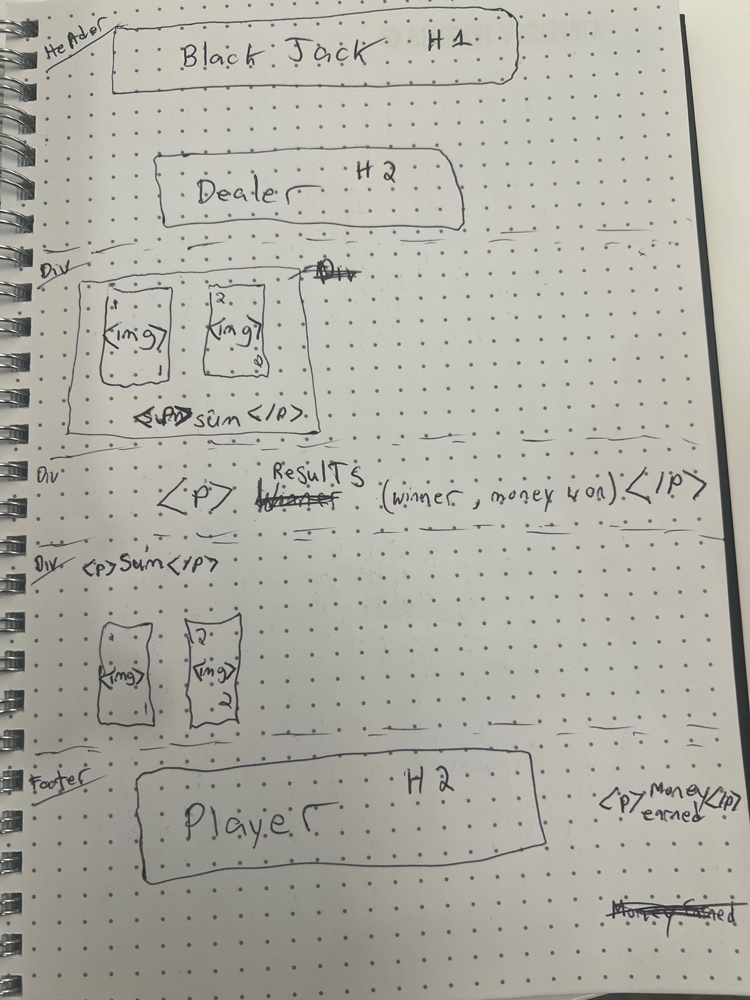

## Project Choice (Tell us which project you're doing!)

- [ ] Flash Cards
- [ ] Trivia (Self-scoring)
- [ ] Spaceman
- [ ] Tower of Hanoi
- [x] Black Jack

## Project Description 

My app is called Black Jack. It's a game app for players who want to play Black Jack online. A player goes up against the dealer to see who gets a total of 21 or whoever gets closer after drawing cards. You are able to make a wager as well, and the amount you won and the result is annouced at the end of the game,whether the player or dealer won or if it was a tie. Users will have the option to play as many times as they desire. A wager must be made before ech game. In the future, I'd like to add a feature where more than one person plays simultaniously. 

## Wire Frames
    
**Initial Landing View**

**Results View**

## Pseudo Code

1.Define required constants:
    1.1) An array that holds 52 cards. ie..S1,s2,s3,s4,d1,d2(For styling purposes). when a card is requested it is pushed to an array that holds the player or dealers hand.
    
2.Define variables used to track the game state:
    2.1) A wager variable to keep track of the wager placed.
    2.2) A variable to count money earned from wagers.
    2.3) A variable for the winner thats set to null by default. Its changed to dealer or winner depending on who won or no winner.
    2.4) A variable for each hands sum.
    2.5) a variable for that renders a message to announce the game results. (money earned, win or draw) 

3.Store elements on the page that will be accessed in code more than once in variables to make code more concise, readable and performant:
    3.1) An array for the cards in players hand and another for dealers hand. Upon initializing 2 cards are immediately drawn from the cards object. It will be rendered on the game table.

4.Loading Phase:
    4.1) The winner should be set to null.
    4.2) message variable is set to "place a wager before start"
    4.3) sum should be set to 0.
    4.4) wager count should be set to 0.
    4.5) card in hand arrays are also 0 for player and dealer.

5.Click handlers:
    5.1) Card in hand arrays will get 2 cards each when the start button is clicked.
    5.1.2) When start button is pressed a function to add the cards in hand initiates.
    5.2) Start button wont work until a wager is made. if wager variable equals 0 then start doesnt work.
    5.3) Message variable is set to empty string after start button is pressed.

## User Stories

#### MVP Goals

- I want the game to tell me how much im waging.
- I want the game to display the cards in hand.
- I want the results of the game to be decalred.
- I want the the hit me button to work.
- I want the stay button to work.
- I want the card selection to be randomized properly.

#### Stretch Goals

- I want to add background music.
- I want fire works when the player wins.
- I want to add a card drawing animation.

#### Notionboard Template
Notionboard template for building projects ( You can use this for any project )
https://www.notion.so/GA-Unit-3-Tunr-Lab-da2c82fafd4e4a7aa654676732db9ee3

#### Timeline - Daily Accountability
Example of a Timeline to keep organized and on task for hitting goals every single day you’re on the sprint for your project.

Create your own table using this markdown table generator website:
https://www.tablesgenerator.com/markdown_tables

Do not neglect to plan, you will thank yourself later for being proactive!
| Day        |   | Task                               | Blockers | Notes/ Thoughts |
|------------|---|------------------------------------|----------|-----------------|
| Thursday   |   | Create and present proposal        |          |                 |
| Friday     |   | Create html, js, css files         |          |                 |
| Saturday   |   | Start on the basic html structure of the game.           |          |                 |
| Sunday     |   | Work on the variables and functions.                  |          |                 |
| Monday     |   | Continue work on functionality and handlers.                        |          |                 |
| Tuesday    |   | Work on styling and any loose ends on the MVP.                      | Possible issue with alignment of elements.         |                 |
| Wedenesday |   | Work on stretch goals              |          |                 |
| Thursday   |   | Continue stretch goals |          |                 |
| Friday     |   | Presentation Day!                  |          |                 |
|            |   |                                    |          |                 |